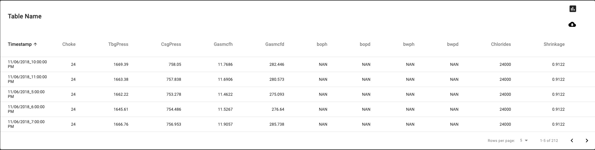

## Real Time Data Dashboard (For Oil Company Client)

### `Challenges`

(1) WebSocket API
We have previous experience with REST APIs and Socket.IO, so initially we were not expecting to face a challenge here. However, we found that we received 2 separate responses in 1 request.
We tried to store response into 2 state or 2 variables which was not successful. After hours of trial and errors,we were able to store data successfully by changing syntax to an arrow function, and then we handled storing the data depending on the type of response data and how we needed to utilize it.

### `Screens`
Main Dashboard

 
Table Data

Initial Planning

### `Built with`

- Websocket API
- React
- Plotly
- CSS
- Material-UI
- Run "npm install" to install all required dependencies

### `Library`

- Material-UI
- react-liquid-gauge
- react-csv
- moment.js

### `Authors`

<ul>
<li><a href="https://github.com/gysobu">Sobha Boddapati</a>: Data table and Websocket API call
</li>
<li><a href="https://github.com/jeanjosephgeorge">Jean George </a>: Grid system and overall design of MainGraph, Plot, LiquidGauge
</li>
<li><a href="https://github.com/acecoder93">Anuj Saheba</a>: MainGraph, Adjusters, Websocket API call
</li>
<li><a href="https://github.com/hirosoft40">Hiroko Ross</a>: LiquidGauge, Websocket API call, Export data table to CSV
</li>
</ul>
